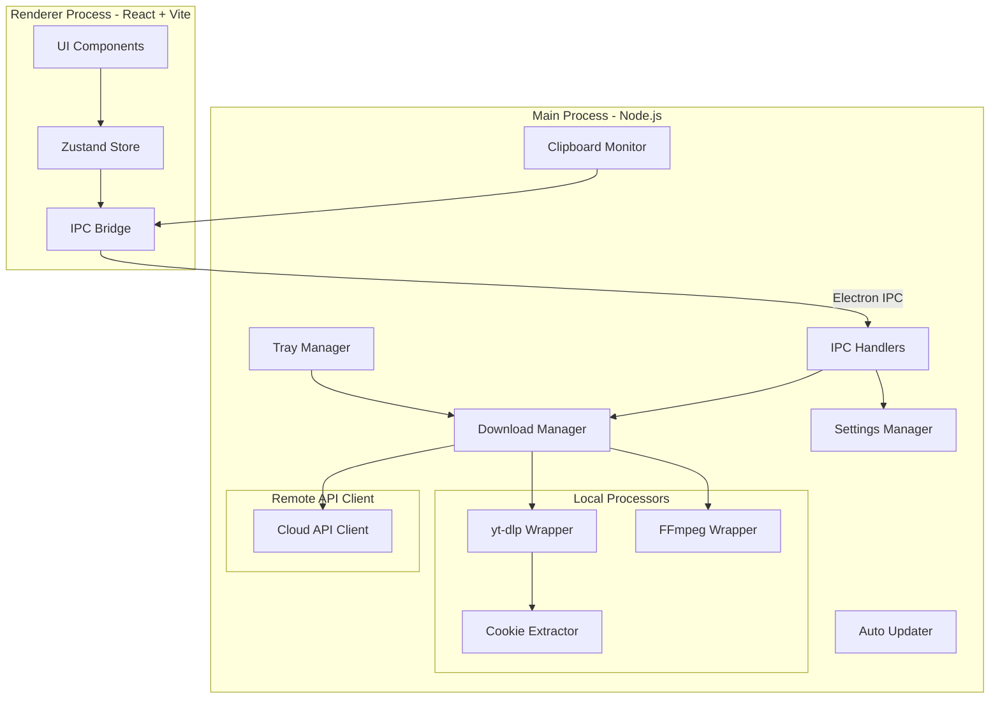
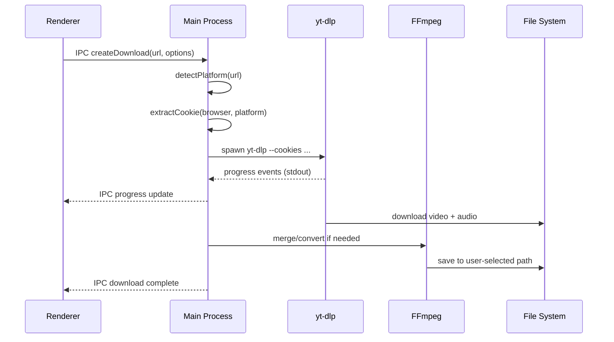
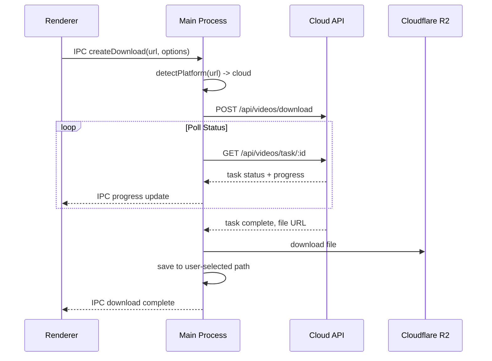
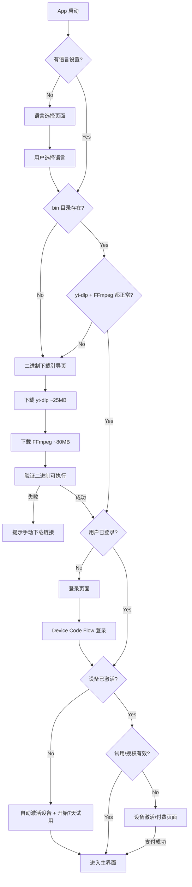
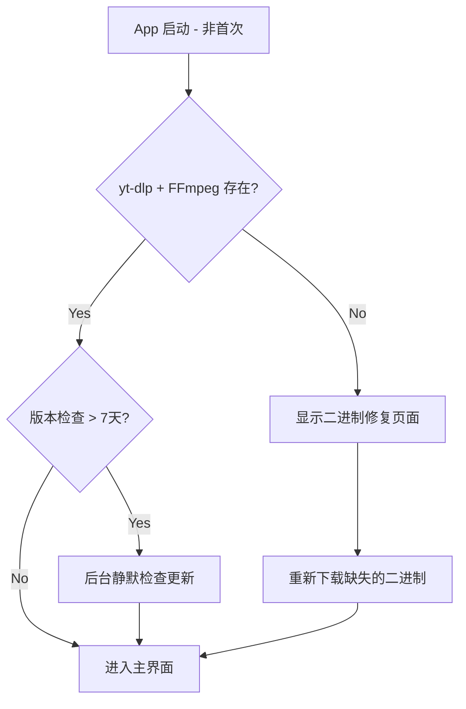
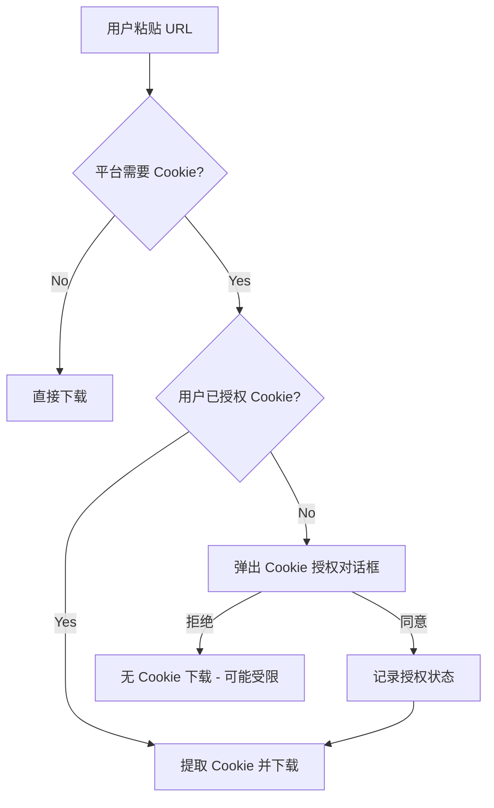
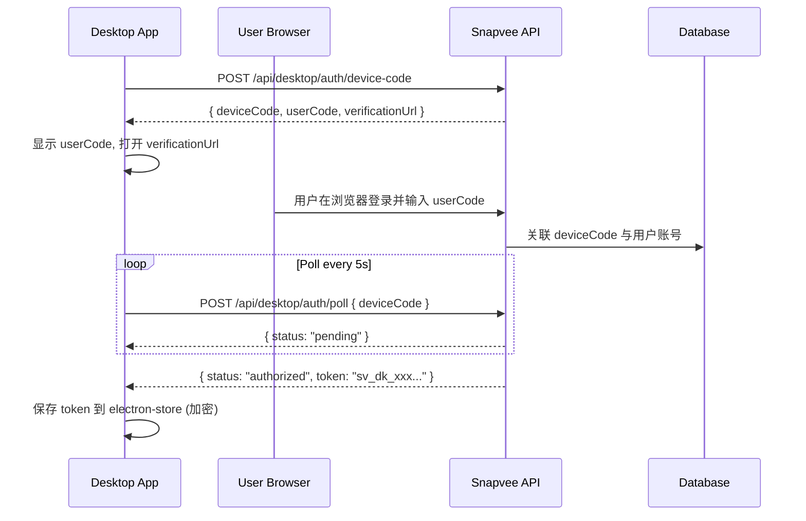

# Snapvee Desktop 桌面端应用方案

## 一、技术选型

| 层面 | Web 版 (现有) | Desktop 版 (新建) |
| ---- | ------------- | ----------------- |

- **框架**: Electron 34+ (Chromium + Node.js)
- **前端**: React 19 + Vite 6 (不需要 Next.js 的 SSR/API Routes)
- **路由**: React Router v7 (替代 Next.js 文件路由)
- **样式**: Tailwind CSS 3 + Radix UI (与 Web 版一致)
- **状态**: Zustand (与 Web 版一致)
- **i18n**: react-intl-universal (与 Web 版一致)
- **本地存储**: electron-store (设置/偏好持久化)
- **本地存储**: electron-store (设置/偏好持久化)
- **打包**: electron-builder (仅 macOS + Windows，不支持 Linux)
- **自动更新**: electron-updater
- **设备指纹**: node-machine-id (设备唯一标识)
- **语言**: TypeScript

## 二、核心架构



## 三、下载策略 -- 混合模式

### 本地处理 (yt-dlp + FFmpeg + 用户 Cookie)

以下平台在用户本机执行，使用 yt-dlp 调用用户浏览器 cookie：

- YouTube -- yt-dlp + cookie (支持会员视频)
- Bilibili -- yt-dlp + cookie (支持大会员)
- Pornhub -- yt-dlp
- Nicovideo -- yt-dlp + cookie
- SoundCloud -- yt-dlp
- 其他 yt-dlp 支持的平台 (不含需要 Puppeteer 的)

**本地处理流程:**



### 云端处理 (调用现有 snapvee API)

以下平台需要 Puppeteer 等特殊处理，或反爬严格不适合本地直连，继续走云端：

- Douyin (抖音) -- 需要 Puppeteer
- Xiaohongshu (小红书) -- 需要 Puppeteer
- Kuaishou (快手) -- 需要 Puppeteer
- Threads -- 需要 Puppeteer
- Instagram -- 需要特殊处理
- Pinterest -- 需要特殊处理
- Twitter/X -- 反爬严格，走云端更稳定
- TikTok -- 走云端统一处理

**云端处理流程:**



## 四、首次启动引导流程



### 4.1 语言选择页面

- 全屏居中卡片，展示 5 种语言: English / 中文 / 日本語 / 한국어 / हिन्दी
- 选择后保存到 electron-store，后续可在设置中更改
- 仅首次启动显示

### 4.2 二进制下载引导页

- 显示 yt-dlp 和 FFmpeg 下载进度
- 进度条 + 当前下载速度 + 预估剩余时间
- 下载失败时提供"重试"和"手动下载"两个选项

### 4.3 登录页面

- 必须登录才能使用 (不登录无法进入主界面)
- Device Code Flow: 显示 6 位验证码 + "打开浏览器"按钮
- 用户在浏览器中登录 snapvee 网站并输入验证码
- 登录成功后自动进入下一步

## 五、账号与设备激活系统

### 5.1 核心规则

- 与 Web 端共享同一套账号 (Supabase)
- **一个账号绑定一台设备**，只能激活一次
- 桌面端新用户首次登录: 自动激活当前设备 + 开始 7 天免费试用
- 7 天试用期内: 无限制使用所有功能
- 试用过期后: 需要付费激活设备才能继续使用
- 设备激活后: 永久绑定，不可转移 (防止一号多机)

### 5.2 设备指纹

```typescript
import { machineIdSync } from "node-machine-id";

// 生成设备唯一 ID (基于 macOS IOPlatformUUID / Windows MachineGuid)
const deviceId = machineIdSync(true); // true = 原始值的 SHA-256 hash

// 设备信息 (激活时上报)
interface DeviceInfo {
  deviceId: string; // SHA-256 hash
  platform: "darwin" | "win32";
  arch: string; // arm64 / x64
  hostname: string; // 电脑名称
  osVersion: string; // macOS 15.0 / Windows 11
  appVersion: string; // Snapvee Desktop 1.0.0
  activatedAt: string; // ISO 时间戳
}
```

### 5.3 数据库设计 (Supabase 新增表)

```sql
-- 桌面端设备激活表
CREATE TABLE snapvee_desktop_devices (
  id UUID PRIMARY KEY DEFAULT gen_random_uuid(),
  user_id UUID NOT NULL REFERENCES auth.users(id),
  device_id VARCHAR(64) NOT NULL UNIQUE,    -- 设备指纹 hash
  device_name VARCHAR(255),                  -- 电脑名称 (方便用户识别)
  platform VARCHAR(10) NOT NULL,             -- darwin / win32
  arch VARCHAR(10),                          -- arm64 / x64
  os_version VARCHAR(50),
  app_version VARCHAR(20),
  activated_at TIMESTAMPTZ NOT NULL DEFAULT NOW(),
  trial_expires_at TIMESTAMPTZ NOT NULL,     -- 试用到期时间 (activated_at + 7天)
  license_status VARCHAR(20) NOT NULL DEFAULT 'trial',
    -- trial: 试用中
    -- active: 已付费激活
    -- expired: 试用过期未付费
  license_activated_at TIMESTAMPTZ,          -- 付费激活时间
  last_seen_at TIMESTAMPTZ DEFAULT NOW(),    -- 最后一次心跳
  created_at TIMESTAMPTZ DEFAULT NOW()
);

-- 一个用户只能有一台激活设备
CREATE UNIQUE INDEX idx_desktop_devices_user ON snapvee_desktop_devices(user_id);

-- 桌面端订单表 (区分 Web 订单)
CREATE TABLE snapvee_desktop_orders (
  id UUID PRIMARY KEY DEFAULT gen_random_uuid(),
  user_id UUID NOT NULL REFERENCES auth.users(id),
  device_id VARCHAR(64) NOT NULL,
  stripe_session_id VARCHAR(255),
  stripe_payment_intent_id VARCHAR(255),
  plan VARCHAR(20) NOT NULL,                 -- 对应 Web 端定价
  amount INTEGER NOT NULL,                   -- 金额 (分)
  currency VARCHAR(3) NOT NULL DEFAULT 'usd',
  status VARCHAR(20) NOT NULL DEFAULT 'pending',
  created_at TIMESTAMPTZ DEFAULT NOW()
);
```

### 5.4 服务端新增 API (在 snapvee-front 中)

```
POST /api/desktop/device/activate
  -> 激活设备 (首次登录时调用)
  -> body: { deviceId, deviceName, platform, arch, osVersion, appVersion }
  -> 返回: { trialExpiresAt, licenseStatus }
  -> 如果用户已有绑定设备且 deviceId 不同 -> 拒绝 (403)

GET /api/desktop/device/status
  -> 查询设备状态
  -> header: Authorization Bearer token
  -> 返回: { licenseStatus, trialExpiresAt, licenseActivatedAt }

POST /api/desktop/device/heartbeat
  -> 设备心跳 (每次启动 + 每小时)
  -> 更新 last_seen_at，检查许可状态

POST /api/desktop/purchase/checkout
  -> 创建 Stripe Checkout Session (桌面端激活购买)
  -> 定价跟 Web 端一致

POST /api/desktop/purchase/webhook
  -> Stripe Webhook 处理桌面端支付完成
  -> 更新 license_status = 'active'
```

### 5.5 客户端激活检查

```typescript
// electron/services/licenseManager.ts
class LicenseManager {
  // 应用启动时检查
  async checkLicense(): Promise<{
    status: "trial" | "active" | "expired" | "no_device";
    trialDaysLeft?: number;
  }> {
    // 1. 本地缓存检查 (electron-store)
    const cached = store.get("license");
    if (cached && Date.now() - cached.checkedAt < 3600000) {
      return cached; // 1小时内用缓存
    }
    // 2. 联网验证 (调用 /api/desktop/device/status)
    const remote = await cloudApi.getDeviceStatus();
    store.set("license", { ...remote, checkedAt: Date.now() });
    return remote;
  }

  // 离线容忍: 如果无法联网，使用本地缓存
  // 最长离线 72 小时，超过则要求联网验证
}
```

### 5.6 桌面端定价页面 (与 Web 端不同)

桌面端定价页面强调:

- **一个账号 = 一台设备**，激活后绑定
- 定价金额与 Web 端一致
- 不显示"批量下载"等 Web 端特有功能
- 突出桌面端优势: 本地下载、无速度限制、使用自己的 Cookie、无服务器排队

## 六、Cookie 提取方案

使用 yt-dlp 原生的 `--cookies-from-browser` 参数，支持：

- Chrome / Chromium
- Firefox
- Edge
- Safari (macOS)
- Brave

用户在设置中选择默认浏览器，下载时自动提取对应平台的 cookie。不需要手动导出 cookie 文件。

## 七、UI 布局设计

### 7.1 布局方案: 侧边栏 + 主内容区

- **窗口风格**: 系统原生标题栏 (macOS 红绿灯 / Windows 标准控件)
- **深色模式**: 跟随系统自动切换 (通过 `nativeTheme.shouldUseDarkColors` 检测)
- **主题色**: 与 Web 端一致，复用 `tailwind.config.ts` 的 CSS 变量

```
+--------------------------------------------------+
|  [原生标题栏]              Snapvee Desktop        |
+--------+-----------------------------------------+
|        |                                         |
|  LOGO  |   URL 输入框                     [下载]  |
|        |                                         |
+--------+-----------------------------------------+
|        |                                         |
| 📥     |   视频信息卡片 / 下载选项                  |
| 下载   |   (分辨率选择、格式选择、保存路径)           |
|        |                                         |
+--------+-----------------------------------------+
| 📋     |                                         |
| 任务   |   下载进度列表                             |
|        |   [视频标题]  ████████░░ 78%  2.5MB/s    |
+--------+   [视频标题]  ██████████ 完成  [打开]     |
| ⚙️     |   [视频标题]  排队中...                    |
| 设置   |                                         |
|        |                                         |
+--------+-----------------------------------------+
|  用户头像  试用剩余: 5天  |  剪贴板: ON            |
+--------------------------------------------------+
```

### 7.2 页面结构

**侧边栏 (固定宽度 ~200px):**

- 顶部: Logo + App 名称
- 导航项 (icon + 文字):
  - 下载 (主页面，URL 输入 + 视频信息 + 下载选项)
  - 任务列表 (所有下载任务的列表，支持筛选/搜索)
  - 设置 (通用/下载/Cookie/账号/关于)
- 底部: 用户头像 + 用户名 + 试用/激活状态

**主内容区:**

- 根据侧边栏选中项切换内容
- 下载页: URL 输入 → 视频信息卡片 → 格式选择 → 进度
- 任务页: 任务列表 (进行中 / 已完成 / 失败)，支持批量操作
- 设置页: 分组设置项

### 7.3 设置页面分组

- **通用**: 语言、深色模式 (跟随系统)、开机自启、最小化到托盘
- **下载**: 默认保存路径、并发数、限速、按平台分文件夹
- **Cookie**: 默认浏览器、Cookie 总开关、按平台开关
- **账号**: 登录状态、设备信息、许可状态、激活/续费
- **关于**: 版本号、yt-dlp 版本、FFmpeg 版本、检查更新

### 7.4 响应式窗口

- 最小窗口: 800x600
- 默认窗口: 1100x750
- 窗口大小可调，侧边栏宽度固定
- 当窗口宽度 < 900 时，侧边栏折叠为仅图标模式

## 八、项目结构

```
snapvee-desktop/
├── electron/                     # Electron 主进程
│   ├── main.ts                   # 入口
│   ├── preload.ts                # Preload 脚本 (IPC bridge)
│   ├── ipc/                      # IPC handler 模块
│   │   ├── download.ts           # 下载相关 IPC
│   │   ├── file.ts               # 文件系统操作
│   │   ├── settings.ts           # 设置读写
│   │   └── auth.ts               # 认证 + 设备激活
│   ├── services/
│   │   ├── downloadManager.ts    # 下载任务队列管理
│   │   ├── ytdlpService.ts       # yt-dlp 封装
│   │   ├── ffmpegService.ts      # FFmpeg 封装
│   │   ├── cloudApiService.ts    # 云端 API 客户端
│   │   ├── binaryManager.ts      # yt-dlp/FFmpeg 二进制管理与更新
│   │   ├── licenseManager.ts     # 设备激活与许可管理
│   │   └── autoUpdater.ts        # 应用自动更新
│   ├── tray.ts                   # 系统托盘
│   ├── clipboard.ts              # 剪贴板监听
│   └── window.ts                 # 窗口管理
├── src/                          # Renderer 前端 (React)
│   ├── App.tsx                   # 根组件
│   ├── main.tsx                  # 入口
│   ├── router.tsx                # React Router 路由配置
│   ├── pages/                    # 页面组件
│   │   ├── DownloadPage.tsx      # 主下载页
│   │   ├── TaskListPage.tsx      # 任务列表页
│   │   ├── SettingsPage.tsx      # 设置页
│   │   ├── PricingPage.tsx       # 定价/激活页 (桌面端专用)
│   │   └── setup/                # 首次启动引导
│   │       ├── LanguageSelect.tsx
│   │       ├── BinarySetup.tsx
│   │       └── LoginSetup.tsx
│   ├── components/               # 从 Web 版复制并适配
│   │   ├── download/             # 下载相关组件
│   │   ├── layout/               # 侧边栏 + 主内容区布局
│   │   │   ├── Sidebar.tsx
│   │   │   ├── MainLayout.tsx
│   │   │   └── StatusBar.tsx     # 底部状态栏
│   │   ├── settings/             # 设置页子组件
│   │   └── ui/                   # 通用 UI 组件
│   ├── hooks/
│   │   ├── useDownload.ts        # 下载 hook (适配 IPC)
│   │   ├── useClipboard.ts       # 剪贴板 hook
│   │   ├── useSettings.ts        # 设置 hook
│   │   └── useLicense.ts         # 许可状态 hook
│   ├── stores/
│   │   ├── downloadStore.ts      # 下载任务状态
│   │   ├── settingsStore.ts      # 应用设置
│   │   └── authStore.ts          # 认证 + 设备状态
│   ├── types/
│   ├── lib/
│   │   ├── language/             # i18n JSON (复制)
│   │   ├── ipc.ts                # IPC 调用封装
│   │   └── platform.ts           # 平台检测工具
│   └── config.ts
├── resources/
│   └── icons/                    # 应用图标 (icns/ico/png)
├── package.json
├── electron-builder.yml          # 打包配置 (macOS + Windows only)
├── vite.config.ts
├── tailwind.config.ts
├── tsconfig.json
├── tsconfig.electron.json
└── .env.example
```

## 九、从 Web 版复制和适配的内容

### 直接复制 (几乎不改)

- `src/lib/language/*.json` -- 5 种语言文件
- `src/types/` -- 类型定义
- `src/components/ui/` -- 基础 UI 组件 (Button, Dialog, Input 等)
- `src/utils/` -- 工具函数
- `tailwind.config.ts` -- 样式配置

### 复制后适配

- `src/components/download/` -- 下载 UI 组件
  - 移除 Next.js 依赖 (next/image, next/link, next/router)
  - API 调用改为 IPC 调用
  - 添加本地文件路径选择
- `src/components/header/` -- 导航栏
  - 简化为桌面端样式 (去掉 SEO、landing 相关)
  - 添加窗口控制按钮 (最小化/最大化/关闭)
- `src/stores/` -- 状态管理
  - 下载 store 适配 IPC 通信
  - 新增 settings store
- `src/lib/processors/` -- 平台检测逻辑
  - 只保留 URL 解析和平台识别部分
  - 实际下载逻辑移到 Electron 主进程

### 不需要复制

- `src/app/api/` -- API 路由 (被 IPC + 主进程服务替代)
- `src/lib/workers/` -- BullMQ Workers (被本地 downloadManager 替代)
- `src/lib/queue/` -- Redis 队列 (不需要)
- `src/lib/auth.ts` -- NextAuth 配置 (云端功能可选保留精简版)
- `src/components/seo/` -- SEO 组件 (桌面端不需要)
- `src/components/landing/` -- Landing 页面 (桌面端不需要)
- `src/middleware.ts` -- Next.js 中间件
- `supabase/` -- 数据库迁移
- `scripts/` -- Worker 启动脚本

## 十、桌面端特有功能

### 1. 自定义保存路径

- 设置页面配置默认下载目录
- 每次下载可临时选择路径
- 按平台自动分文件夹 (可选)

### 2. 系统托盘 + 后台下载

- 关闭窗口时最小化到托盘
- 托盘菜单：显示窗口、暂停所有、退出
- 托盘气泡通知下载完成
- 下载进度显示在 Dock 图标 (macOS) / 任务栏 (Windows)

### 3. 自动更新

- electron-updater + GitHub Releases (或自建更新服务器)
- 后台检查更新，提示用户安装
- yt-dlp 和 FFmpeg 独立更新（不需要更新整个应用）

### 4. 剪贴板监听

- 后台监听剪贴板变化
- 检测到支持的 URL 时弹出通知/弹窗
- 用户确认后自动开始下载
- 可在设置中开关

## 十一、二进制文件管理 (yt-dlp / FFmpeg) -- 方案 A 详细设计

采用首次启动自动下载方案，安装包保持小体积，二进制独立于应用更新。

### 8.1 存储位置

```
// Electron app data 目录
// macOS: ~/Library/Application Support/snapvee-desktop/
// Windows: %APPDATA%/snapvee-desktop/

{appData}/
├── bin/
│   ├── yt-dlp                    # (macOS) 或 yt-dlp.exe (Windows)
│   ├── ffmpeg                    # 或 ffmpeg.exe
│   └── ffprobe                   # 或 ffprobe.exe
├── bin-version.json              # 版本跟踪文件
└── temp/                         # 下载临时目录
```

### 8.2 bin-version.json 结构

```json
{
  "ytdlp": {
    "version": "2025.12.23",
    "path": "/path/to/bin/yt-dlp",
    "downloadedAt": "2025-12-24T00:00:00Z",
    "source": "https://github.com/yt-dlp/yt-dlp/releases/latest"
  },
  "ffmpeg": {
    "version": "7.1",
    "path": "/path/to/bin/ffmpeg",
    "downloadedAt": "2025-12-24T00:00:00Z",
    "source": "https://github.com/BtbN/FFmpeg-Builds/releases"
  },
  "lastUpdateCheck": "2025-12-25T00:00:00Z"
}
```

### 8.3 binaryManager.ts 核心逻辑

```typescript
// electron/services/binaryManager.ts
class BinaryManager {
  private binDir: string; // app.getPath('userData') + '/bin'

  // 1. 检查二进制是否存在且可执行
  async checkBinaries(): Promise<{ ytdlp: boolean; ffmpeg: boolean }>;

  // 2. 下载二进制 (首次启动 or 手动更新)
  //    - yt-dlp: 从 GitHub releases 下载对应平台的 binary
  //      macOS: yt-dlp_macos (arm64/x64 自动判断)
  //      Windows: yt-dlp.exe
  //    - FFmpeg: 从 BtbN/FFmpeg-Builds 下载 static build
  //      macOS: ffmpeg-master-latest-macosarm64-gpl.tar.xz
  //      Windows: ffmpeg-master-latest-win64-gpl.zip
  async downloadBinary(
    name: "ytdlp" | "ffmpeg",
    onProgress: (pct: number) => void,
  ): Promise<void>;

  // 3. 检查更新 (对比 GitHub latest release tag)
  async checkForUpdates(): Promise<{ ytdlp?: string; ffmpeg?: string } | null>;

  // 4. 执行更新: 下载新版本 -> 替换旧文件 -> 更新 version.json
  //    用 .new 后缀下载，成功后 rename 替换，避免更新中断导致二进制损坏
  async updateBinary(name: "ytdlp" | "ffmpeg"): Promise<void>;

  // 5. 获取二进制路径 (供 ytdlpService / ffmpegService 调用)
  getBinaryPath(name: "ytdlp" | "ffmpeg"): string;
}
```

### 11.4 非首次启动时的二进制检查



### 8.5 yt-dlp 热更新机制

yt-dlp 更新非常频繁 (YouTube 反爬变化快)，需要专门的更新策略：

- **自动检查**: 每次 App 启动时后台检查 GitHub API `https://api.github.com/repos/yt-dlp/yt-dlp/releases/latest`
- **更新频率**: 至少每 3 天检查一次，或下载失败时立即检查
- **静默更新**: 没有下载任务在跑时，后台下载新版本并替换
- **失败回退**: 如果新版本下载后验证失败 (`yt-dlp --version`)，保留旧版本
- **强制更新提示**: 当 yt-dlp 下载持续报错且有新版本时，弹窗提示用户更新
- **手动触发**: 设置页面提供"立即检查更新"按钮

## 十二、跨平台签名与公证

### 9.1 macOS 签名与公证

**前置条件:**

- Apple Developer Program 账号 ($99/年)
- Developer ID Application 证书 (用于签名分发在 App Store 之外的 app)
- Developer ID Installer 证书 (用于签名 .pkg 安装包)

**electron-builder.yml macOS 配置:**

```yaml
mac:
  target:
    - target: dmg
      arch: [arm64, x64] # 同时支持 Apple Silicon 和 Intel
    - target: zip
      arch: [arm64, x64]
  category: public.app-category.utilities
  hardenedRuntime: true # 必须开启，公证要求
  gatekeeperAssess: false
  entitlements: build/entitlements.mac.plist
  entitlementsInherit: build/entitlements.mac.plist

afterSign: scripts/notarize.js # 签名后自动公证
```

**entitlements.mac.plist (权限声明):**

```xml
<?xml version="1.0" encoding="UTF-8"?>
<!DOCTYPE plist PUBLIC "-//Apple//DTD PLIST 1.0//EN"
  "http://www.apple.com/DTDs/PropertyList-1.0.dtd">
<plist version="1.0">
<dict>
  <key>com.apple.security.cs.allow-jit</key>              <true/>
  <key>com.apple.security.cs.allow-unsigned-executable-memory</key> <true/>
  <key>com.apple.security.cs.allow-dyld-environment-variables</key> <true/>
  <key>com.apple.security.network.client</key>             <true/>
  <key>com.apple.security.files.user-selected.read-write</key>     <true/>
</dict>
</plist>
```

**公证脚本 (scripts/notarize.js):**

```javascript
// 使用 @electron/notarize 包
const { notarize } = require("@electron/notarize");

exports.default = async function notarizing(context) {
  if (process.platform !== "darwin") return;
  const appId = "com.snapvee.desktop";
  const appPath = `${context.appOutDir}/${context.packager.appInfo.productFilename}.app`;

  await notarize({
    appBundleId: appId,
    appPath,
    appleId: process.env.APPLE_ID, // Apple ID 邮箱
    appleIdPassword: process.env.APPLE_APP_PASSWORD, // App 专用密码
    teamId: process.env.APPLE_TEAM_ID, // 开发者团队 ID
  });
};
```

**CI/CD 环境变量:**

- `CSC_LINK` -- 导出的 .p12 证书文件 (base64)
- `CSC_KEY_PASSWORD` -- 证书密码
- `APPLE_ID` -- Apple ID 邮箱
- `APPLE_APP_PASSWORD` -- App 专用密码 (在 appleid.apple.com 生成)
- `APPLE_TEAM_ID` -- 开发者团队 ID

### 9.2 Windows 签名

**选项 A: EV 代码签名证书 (推荐)**

- 购买 EV (Extended Validation) 代码签名证书
- 优点: 首次发布就能获得 SmartScreen 信任，不会弹安全警告
- 缺点: 贵 (~$300-500/年)，需要硬件 USB token
- 供应商: DigiCert, Sectigo, GlobalSign

**选项 B: OV 代码签名证书**

- 普通 OV (Organization Validation) 证书
- 优点: 便宜 (~$70-200/年)，不需要硬件 token
- 缺点: 需要积累 SmartScreen 信誉，初期用户仍会看到警告
- 供应商: Certum (最便宜，个人开发者可用)

**electron-builder.yml Windows 配置:**

```yaml
win:
  target:
    - target: nsis
      arch: [x64, arm64]
    - target: portable # 便携版 (不需要安装)
  sign: true
  signingHashAlgorithms: [sha256]
  certificateSubjectName: "Snapvee" # 或用 certificateFile + certificatePassword

nsis:
  oneClick: false # 允许选择安装路径
  allowToChangeInstallationDirectory: true
  installerIcon: resources/icons/icon.ico
  uninstallerIcon: resources/icons/icon.ico
  createDesktopShortcut: true
  createStartMenuShortcut: true
```

### 9.3 CI/CD 自动化签名 (GitHub Actions)

```yaml
# .github/workflows/build.yml 关键片段
jobs:
  build-mac:
    runs-on: macos-latest
    env:
      CSC_LINK: ${{ secrets.MAC_CERT_P12_BASE64 }}
      CSC_KEY_PASSWORD: ${{ secrets.MAC_CERT_PASSWORD }}
      APPLE_ID: ${{ secrets.APPLE_ID }}
      APPLE_APP_PASSWORD: ${{ secrets.APPLE_APP_PASSWORD }}
      APPLE_TEAM_ID: ${{ secrets.APPLE_TEAM_ID }}
    steps:
      - run: npx electron-builder --mac

  build-win:
    runs-on: windows-latest
    env:
      CSC_LINK: ${{ secrets.WIN_CERT_PFX_BASE64 }}
      CSC_KEY_PASSWORD: ${{ secrets.WIN_CERT_PASSWORD }}
    steps:
      - run: npx electron-builder --win
```

## 十三、Cookie 安全方案

### 10.1 原则

- **最小权限**: 只在用户主动触发下载时提取 cookie，不后台静默读取
- **不存储**: cookie 只在内存中存在，传给 yt-dlp 后立即丢弃，不写入磁盘
- **域名限定**: 只提取目标平台的 cookie (如 `.youtube.com`, `.bilibili.com`)
- **用户知情**: 首次使用 cookie 功能时弹出授权对话框

### 10.2 Cookie 授权流程



### 10.3 授权对话框内容

```
Cookie 使用授权

为了下载需要登录的视频（如 YouTube 会员内容、Bilibili 大会员视频），
Snapvee 需要读取你浏览器中对应网站的 Cookie。

- Cookie 仅用于 yt-dlp 下载，不会上传到任何服务器
- Cookie 不会保存到本地磁盘，仅在下载过程中临时使用
- 你可以随时在设置中关闭此功能

选择浏览器: [Chrome ▾]

[拒绝]  [同意并继续]
```

### 10.4 技术实现

```typescript
// 使用 yt-dlp 原生 --cookies-from-browser 参数
// 不需要自己解析 cookie 数据库，yt-dlp 直接处理

const args = [
  url,
  "--cookies-from-browser",
  `${browser}`, // chrome, firefox, edge, safari, brave
  "-o",
  outputPath,
  "--progress",
  "--newline",
  // ... 其他参数
];

// yt-dlp 会在运行时读取浏览器 cookie 数据库
// macOS Chrome: ~/Library/Application Support/Google/Chrome/Default/Cookies
// Windows Chrome: %LOCALAPPDATA%\Google\Chrome\User Data\Default\Network\Cookies
// 读取后 cookie 只在 yt-dlp 进程内存中，进程结束即释放
```

### 10.5 设置页面 Cookie 选项

- 默认浏览器选择: Chrome / Firefox / Edge / Safari / Brave
- Cookie 功能总开关: 默认开启
- 按平台开关: YouTube Cookie / Bilibili Cookie / ...
- "清除授权"按钮: 重置所有 cookie 授权状态

## 十四、云端 API 认证方案

桌面端调用 snapvee 云端 API 时需要一套独立的认证机制。

### 11.1 推荐方案: Device Code Flow + API Token

**流程:**



**为什么不用 OAuth 回调?**

- Electron 内嵌浏览器做 OAuth 有安全风险 (可能被钓鱼)
- Device Code Flow 是 CLI/桌面应用的标准做法 (类似 GitHub CLI `gh auth login`)
- 用户在自己的浏览器中登录，更安全

### 11.2 API Token 格式

```
sv_dk_{userId}_{randomBytes(32).hex}_{timestamp}
```

- 前缀 `sv_dk_` 表示 desktop client token
- 有效期: 长期有效 (不过期)，但可以在 Web 端个人设置中撤销
- 存储: 使用 `safeStorage.encryptString()` 加密后存入 electron-store

### 11.3 API 请求鉴权

```typescript
// electron/services/cloudApiService.ts
class CloudApiService {
  private token: string; // 从 electron-store 解密获取

  async request(endpoint: string, options?: RequestInit) {
    return fetch(`${API_BASE_URL}${endpoint}`, {
      ...options,
      headers: {
        Authorization: `Bearer ${this.token}`,
        "X-Client": "snapvee-desktop",
        "X-Client-Version": app.getVersion(),
        ...options?.headers,
      },
    });
  }
}
```

### 11.4 服务端新增 API

在现有 snapvee-front 中新增以下 API (不影响现有功能):

- `POST /api/desktop/auth/device-code` -- 生成设备码
- `POST /api/desktop/auth/poll` -- 轮询授权状态
- `GET /api/desktop/auth/verify` -- 验证页面 (用户在浏览器中打开)
- `POST /api/desktop/auth/revoke` -- 撤销 token

### 14.5 登录为必须

- 桌面端必须登录才能使用 (与 Web 共享账号)
- 登录后自动绑定设备、开始试用
- token 使用 `safeStorage.encryptString()` 加密存储
- 登出时清除本地 token，但设备绑定不解除

## 十五、下载并发控制

### 12.1 downloadManager 设计

```typescript
// electron/services/downloadManager.ts
interface DownloadTask {
  id: string;
  url: string;
  platform: string;
  mode: "local" | "cloud";
  status:
    | "queued"
    | "downloading"
    | "merging"
    | "completed"
    | "failed"
    | "paused";
  progress: number; // 0-100
  speed: string; // "2.5 MB/s"
  eta: string; // "00:03:25"
  outputPath: string;
  pid?: number; // yt-dlp 子进程 PID (用于暂停/取消)
  createdAt: number;
  error?: string;
}

class DownloadManager {
  private queue: DownloadTask[] = [];
  private active: Map<string, DownloadTask> = new Map();
  private maxConcurrent: number = 3; // 默认最大并发 3
  private maxConcurrentCloud: number = 2; // 云端并发 2 (共用服务器资源)

  // 添加任务到队列
  addTask(url: string, options: DownloadOptions): DownloadTask;

  // 处理队列: 有空位就从 queue 取出执行
  private processQueue(): void;

  // 本地下载: spawn yt-dlp 子进程
  private executeLocal(task: DownloadTask): Promise<void>;

  // 云端下载: 调用 API + 轮询 + 下载文件
  private executeCloud(task: DownloadTask): Promise<void>;

  // 暂停: 发送 SIGSTOP 给 yt-dlp 子进程 (仅本地)
  pauseTask(taskId: string): void;

  // 恢复: 发送 SIGCONT
  resumeTask(taskId: string): void;

  // 取消: kill 子进程 + 删除临时文件
  cancelTask(taskId: string): void;

  // 获取所有任务状态 (供渲染进程展示)
  getAllTasks(): DownloadTask[];
}
```

### 12.2 并发策略

- **本地下载并发**: 默认 3，用户可在设置中调 1-5
- **云端下载并发**: 固定 2 (避免给服务端造成压力)
- **总并发**: 本地 + 云端 不超过 5
- **队列优先级**: 手动触发 > 剪贴板自动识别
- **网络感知**: 检测到 Wi-Fi 且电量充足时允许更多并发 (可选)

### 12.3 带宽限制

```typescript
// yt-dlp 原生支持限速
const args = [
  url,
  "--limit-rate",
  settings.maxDownloadSpeed || "0", // '0' = 不限速, '10M' = 10MB/s
  // ...
];
```

- 设置页面提供限速选项: 不限制 / 5MB/s / 10MB/s / 20MB/s / 自定义
- 分时段限速 (可选, 后期): 工作时间限速，夜间不限

### 12.4 任务持久化

```typescript
// 使用 electron-store 持久化任务列表
// 应用重启后恢复未完成的任务
const store = new Store({
  name: "download-tasks",
  schema: {
    tasks: { type: "array", default: [] },
  },
});

// 应用启动时:
// 1. 加载所有 status !== 'completed' 的任务
// 2. 将 'downloading'/'merging' 状态重置为 'queued'
// 3. 重新加入队列
```

## 十六、大文件处理与磁盘空间

### 13.1 下载前磁盘空间检查

```typescript
import { statfs } from "fs/promises";

async function checkDiskSpace(downloadPath: string): Promise<{
  available: number; // 可用空间 (bytes)
  sufficient: boolean; // 是否足够
}> {
  const stats = await statfs(downloadPath);
  const available = stats.bavail * stats.bsize;

  return {
    available,
    sufficient: available > 1024 * 1024 * 500, // 至少 500MB 可用
  };
}
```

### 13.2 预估文件大小

```typescript
// yt-dlp 获取视频信息时可以拿到预估大小
const args = [url, "--dump-json", "--no-download"];
// 返回 JSON 中包含:
// - filesize: 精确大小 (不一定有)
// - filesize_approx: 预估大小
// - duration: 时长 (可用于估算)

// 预估逻辑:
// 720p 视频: ~3-5 MB/分钟
// 1080p 视频: ~8-15 MB/分钟
// 4K 视频: ~30-60 MB/分钟
```

### 13.3 下载过程中的磁盘监控

```typescript
// 每 30 秒检查一次磁盘空间
private diskSpaceMonitor = setInterval(async () => {
  const { available, sufficient } = await checkDiskSpace(this.downloadPath);

  if (!sufficient) {
    // 暂停所有下载任务
    this.pauseAllTasks();
    // 通知渲染进程显示警告
    this.mainWindow.webContents.send('disk-space-warning', {
      available,
      message: '磁盘空间不足，已暂停所有下载'
    });
  }
}, 30000);
```

### 13.4 临时文件清理

```typescript
// yt-dlp 下载过程中会产生临时文件 (.part, .ytdl)
// 下载完成或取消后需要清理

class TempFileCleaner {
  // 应用启动时清理上次残留的临时文件
  async cleanOrphanedTempFiles(): Promise<void> {
    const tempDir = path.join(app.getPath("userData"), "temp");
    const files = await readdir(tempDir);
    for (const file of files) {
      if (file.endsWith(".part") || file.endsWith(".ytdl")) {
        await unlink(path.join(tempDir, file));
      }
    }
  }

  // 定期清理 (每 24 小时)
  // 删除超过 48 小时的已完成下载的临时文件
  async periodicCleanup(): Promise<void>;
}
```

## 十七、开发阶段划分

### Phase 1: 基础骨架 (1-2 周)

- Electron + Vite + React + TypeScript + Tailwind 项目搭建
- 窗口管理 (原生标题栏、最小 800x600、默认 1100x750)
- 侧边栏 + 主内容区布局骨架
- React Router 路由、IPC 通信骨架、preload 脚本
- electron-store 基础
- 深色模式跟随系统 (`nativeTheme`)

### Phase 2: 首次启动引导 + 账号系统 (2 周)

- 语言选择页面 (5 种语言)
- binaryManager: yt-dlp/FFmpeg 下载引导
- Device Code Flow 登录流程 (必须登录)
- licenseManager: 设备指纹 (node-machine-id)、自动激活、试用期管理
- Web 端 (snapvee-front) 新增:
  - `/api/desktop/auth/*` API (device-code, poll, verify, revoke)
  - `/api/desktop/device/*` API (activate, status, heartbeat)
  - `/api/desktop/purchase/*` API (checkout, webhook)
  - Supabase 新增 `snapvee_desktop_devices` + `snapvee_desktop_orders` 表

### Phase 3: 本地下载核心 (2-3 周)

- ytdlpService: yt-dlp 封装 (spawn, progress parsing, cookie 传递)
- ffmpegService: FFmpeg 封装 (merge, convert)
- downloadManager: 任务队列、并发控制、暂停/恢复/取消
- Cookie 授权对话框与浏览器选择
- 磁盘空间检查与临时文件清理
- 任务持久化 (重启恢复)

### Phase 4: UI 移植 + 桌面端专属页面 (2 周)

- 从 Web 版复制适配: 下载组件、UI 组件、i18n
- 侧边栏导航: 下载 / 任务列表 / 设置
- 设置页 (通用/下载/Cookie/账号/关于)
- 桌面端定价页 (一账号一设备、Stripe 支付激活)
- 任务列表页 (进行中/已完成/失败、批量操作)
- 适配: 移除 Next.js 依赖 (next/image, next/link, next/router)

### Phase 5: 云端 API + 桌面特有功能 (2 周)

- cloudApiService: 云端下载 (抖音/小红书/快手/Twitter/TikTok 等)
- 系统托盘 + 后台下载 + 下载完成通知
- 剪贴板监听 (URL 检测 + 弹窗确认)
- yt-dlp 热更新机制 (自动检查 + 静默更新)
- 应用自动更新 (electron-updater)

### Phase 6: 打包发布 (1-2 周)

- electron-builder 配置 (macOS dmg/zip + Windows nsis/portable)
- macOS 代码签名 + 公证 (Apple Developer)
- Windows 代码签名 (EV/OV 证书)
- GitHub Actions CI/CD 流水线
- 官网下载页 + GitHub Releases 分发
