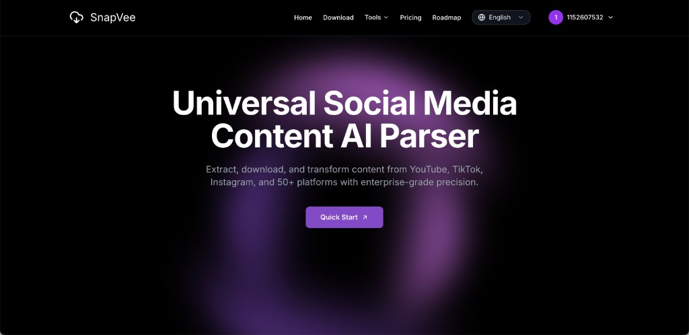
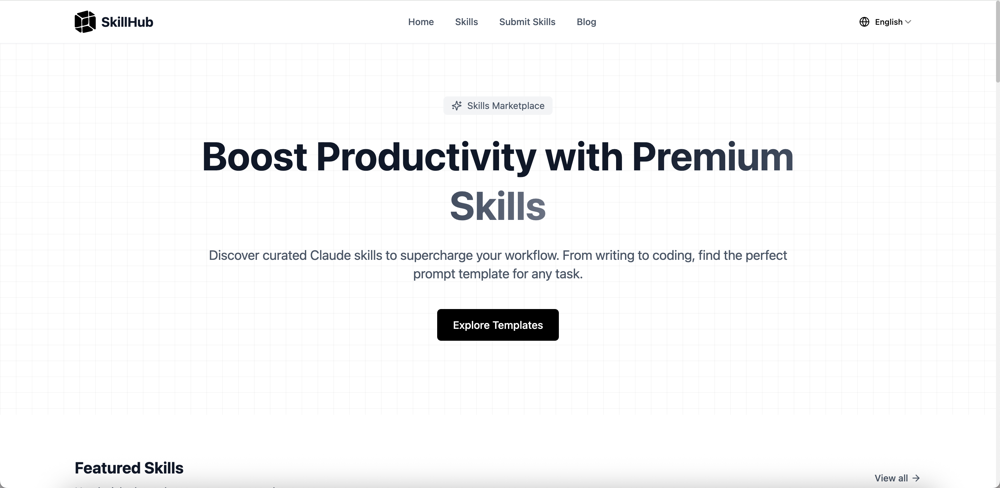
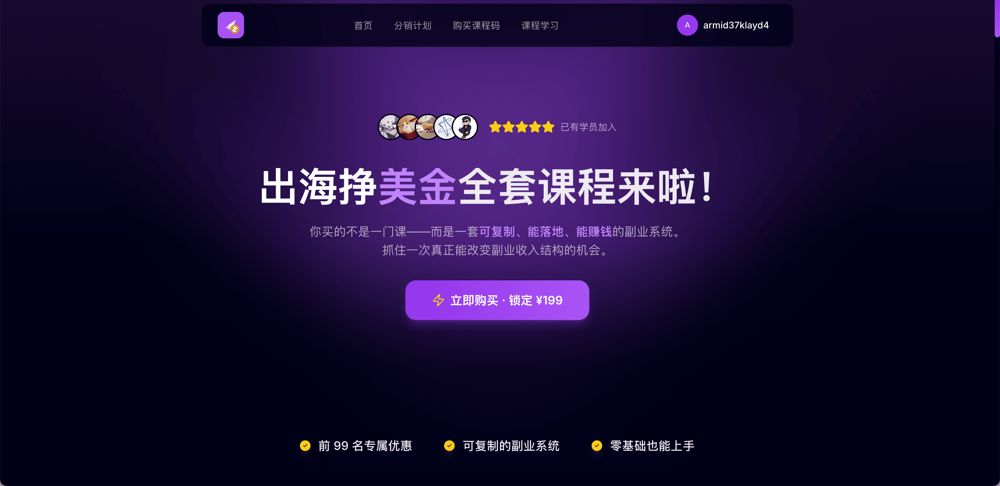

# full-stack Quickstart Guide

Language: **English (default)** | [中文](./README.zh-CN.md)

A full-stack project based on Next.js 16 + React 19, including:

- Web frontend and API routes
- Auth and Supabase integration
- Stripe / Alipay payment flows
- Email sending (Resend)
- Cleanup scripts

## Website Case

**[SnapVee](https://snapvee.com)** — Universal Social Media Content AI Parser. Extract, download, and transform content from YouTube, TikTok, Instagram, and 50+ platforms with enterprise-grade precision.



**[SkillHub](https://skillforge.cc/)** — Claude Skills & GPT Skills Marketplace. Discover curated premium skills to supercharge your workflow, from writing to coding. Battle-tested prompt templates for any task.



**[出海挣美金](https://course.jchencode.com/)** — A practical course for building passive income English websites from zero. Systematized learning path covering SEO, monetization, and AI-powered content production.



## 1. Requirements

- Node.js `>= 20.9`
- Bun `>= 1.2.x` (recommended, project includes `bun.lock`)
- Reachable Supabase / Redis / payment services (depends on enabled features)

## 2. Quick Start (Local Dev)

```bash
# 1) Install dependencies
bun install

# 2) Prepare env
cp .env.example .env.local

# 3) Start dev server (webpack by default, more stable)
bun run dev
```

Then open:

- `http://localhost:3000`

## 3. Required Environment Variables (Minimum)

Set these first to avoid common runtime errors:

```env
# Auth
NEXTAUTH_SECRET=replace_me

# Supabase
NEXT_PUBLIC_SUPABASE_URL=https://xxx.supabase.co
SUPABASE_PUBLISHABLE_DEFAULT_KEY=xxx
SUPABASE_SERVICE_ROLE_KEY=xxx

# Local callback base URL (used by payment flows)
NEXT_PUBLIC_BASE_URL=http://localhost:3000
NEXTAUTH_URL=http://localhost:3000
```

Optional by feature:

- Stripe: `STRIPE_SECRET_KEY`, `STRIPE_WEBHOOK_SECRET`, `STRIPE_PRICE_ID_*`
- Alipay: `ALIPAY_*`
- Email: `RESEND_API_KEY`, `SMTP_USER`, `SMTP_HOST`
- Redis: `REDIS_HOST`, `REDIS_PORT`, `REDIS_PASSWORD`
- R2: `CLOUDFLARE_R2_*`

## 4. Common Commands

```bash
# Dev (recommended)
bun run dev

# Dev (Turbopack)
bun run dev:turbopack

# Lint
bun run lint

# Build / Start
bun run build
bun run start

# Test env build/start (.env.test)
bun run build:test
bun run start:test

# Prod env build/start (.env.production)
bun run build:prod
bun run start:prod
```

## 5. Env Loading Order

From `scripts/load-env.js`:

- Development: `.env.local` -> `.env.development` -> `.env`
- Test: `.env.test` -> `.env`
- Production: `.env.production` -> `.env`

Notes:

- System env vars have highest priority and are not overridden.
- Defaults are applied when missing: `NODE_ENV`, `APP_ENV`.

## 6. Project Layout

- `src/app`: pages and API routes
- `src/components`: UI and feature components
- `src/lib`: auth, payment, email, storage utilities
- `scripts`: env startup and cleanup scripts
- `supabase`: Supabase-related config

## 7. Troubleshooting

### 1) `localhost` returns 500

Check missing env vars first, usually:

- Supabase keys not configured
- Payment env vars missing while payment code path is triggered

### 2) `Module not found` / startup errors

```bash
rm -rf .next
bun install
bun run dev
```

### 3) Port 3000 is occupied

Next.js will auto-switch to another port, or free `3000` and restart.

## 8. Current Repo Note

`package.json` has worker scripts (`worker`, `worker:convert`, etc.), but corresponding `scripts/start-*.ts` files may be missing in this repo snapshot.  
If you need workers, add those scripts or sync the complete worker code.
